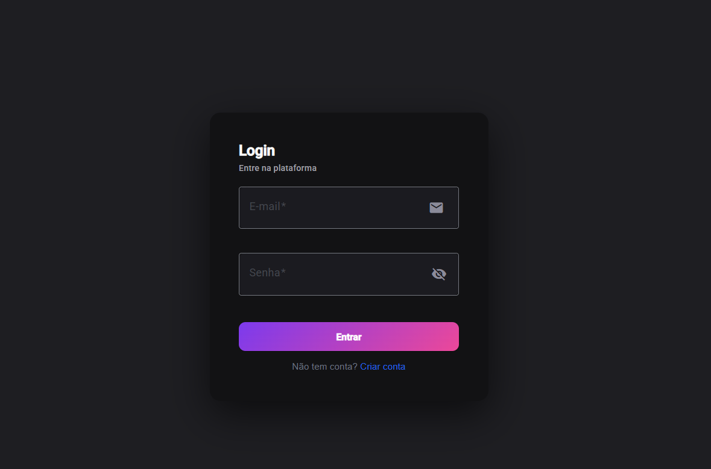
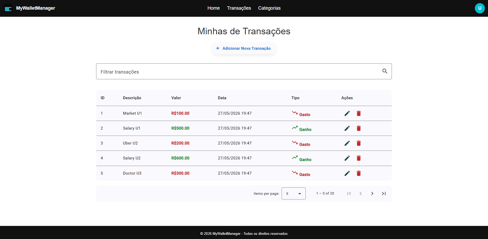
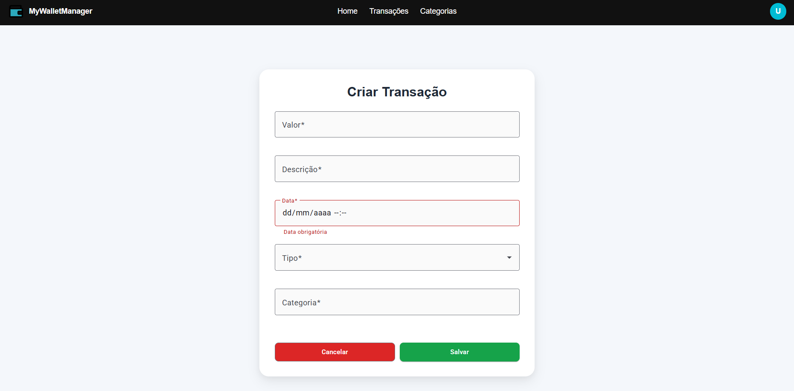
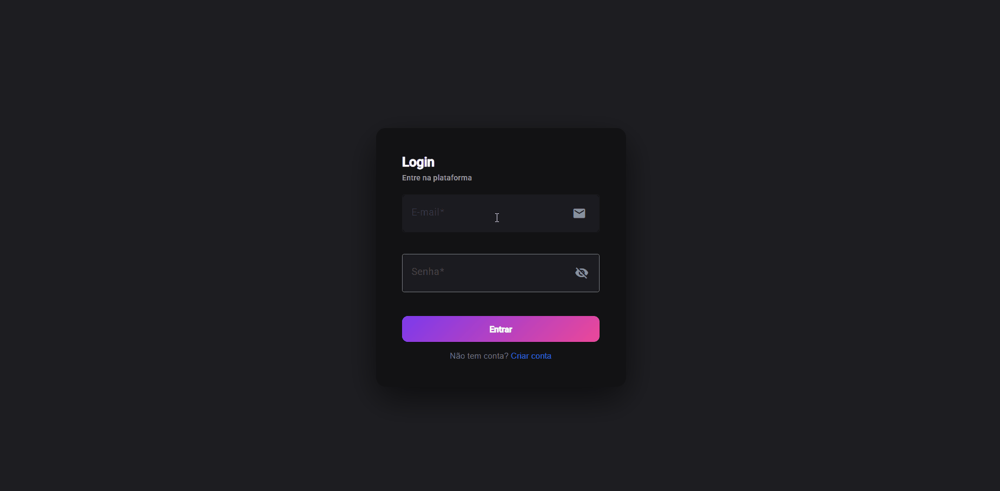

# Wallet Manager Frontend

<div align="center">


Interface web para gerenciamento financeiro pessoal integrada ao backend Wallet Manager.

</div>

---

## 📌 Sobre o projeto

O **Wallet Manager Frontend** é uma aplicação em Angular para controle financeiro pessoal.

Permite autenticação de usuários e gerenciamento de transações e categorias de forma simples e organizada, consumindo uma API REST com JWT.

---

## 🚀 Funcionalidades

### 🔐 Autenticação
- Login de usuário
- Registro de usuário
- Logout
- Persistência de sessão com JWT

### 💰 Transações
- Criar transações
- Editar transações
- Remover transações
- Filtro por período

### 🗂 Categorias
- Criar categorias
- Editar categorias
- Remover categorias

---

## 🧪 Usuários de teste

### ADMIN
Email: user1@mail.com
Senha: 123

### USER
Email: user2@mail.com
Senha: 123

---

## 🖼️ Preview do sistema

### Login


### Transações


### Criar Transações


### Demo do sistema




---

## 🧱 Tecnologias utilizadas

- Angular 19
- TypeScript
- RxJS
- Angular Router
- HTTP Client
- JWT Authentication
- Tailwind CSS

---

## 🔗 Integração com backend

Este frontend consome a API do backend:

👉 Wallet Manager Backend  
https://github.com/IgorDv5/WalletManager-Backend

---

## ⚙️ Como executar o projeto

### Pré-requisitos
- Node.js
- Angular CLI

---

### Instalar dependências

```bash
npm install
```

Rodar o projeto
```
ng serve
```
